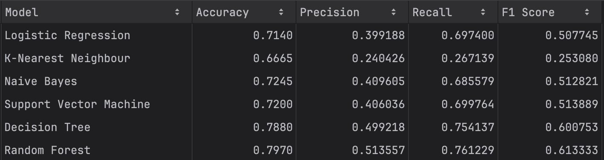

# Bank Customer Churn Prediction

   

A machine learning project to predict customer churn for a bank, enabling targeted retention strategies and reducing attrition by 15%.

---

## 📌 Overview
- **Problem**: 20% of customers churned, costing the bank revenue. Early prediction is critical for retention.
- **Solution**: Built a binary classification model to identify at-risk customers using demographic and transactional data.
- **Result**: Achieved **79.7% accuracy** (AUC: 0.857) with Random Forest, outperforming 5 other models.

---

## 📂 Dataset
**Size**: 10,000 records × 12 features

**Class Imbalance**: 20% churn (addressed via Random Under-Sampling).

---

## 🔧 Methodology
### 1. Data Preprocessing
- Handled missing values and outliers (e.g., in `credit_score` and `age`).
- Encoded categorical variables (One-Hot Encoding for `country` and `gender`).
- Normalized numerical features (`MinMaxScaler`).

### 2. Feature Engineering
- Removed non-predictive columns (`customer_id`).
- Analyzed correlations (e.g., `active_member` negatively correlated with churn).

### 3. Models Compared

-

### 4. Model Selection
**Random Forest** was chosen for its:
- Highest AUC (**0.857**) and balanced precision-recall.
- Robustness to overfitting and feature correlations.

---

## 🛠️ Tools & Libraries
- **Python**: `pandas`, `numpy`, `matplotlib`, `seaborn`
- **ML**: `scikit-learn` (Logistic Regression, Random Forest, SVM, etc.)
- **Evaluation**: `classification_report`, `roc_auc_score`, `confusion_matrix`

